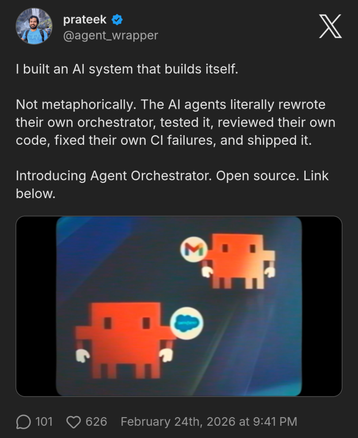
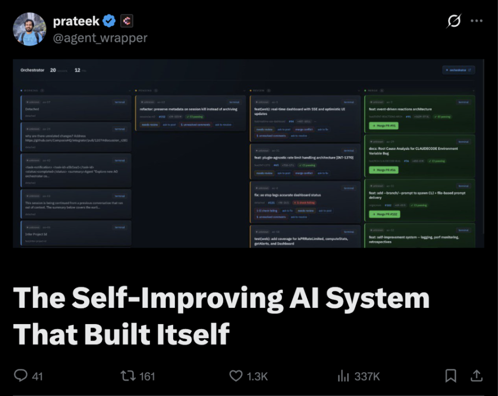
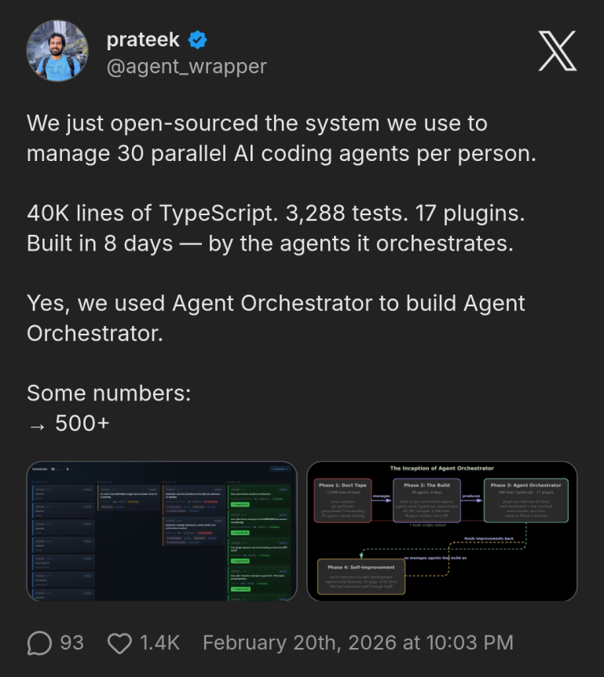

<div align="center">
  

# Agent Orchestrator

**The orchestration layer for parallel AI coding agents**

[](https://github.com/AgentWrapper/agent-orchestrator/stargazers)
[](https://github.com/AgentWrapper/agent-orchestrator/graphs/contributors)
[](https://x.com/aoagents)
[](https://discord.com/invite/UZv7JjxbwG)
[](LICENSE)

An Agentic IDE that supervises parallel AI coding agents in isolated workspaces, with complete control and automatic feedback loops from CI failures, review comments, and merge conflicts.


</div>

---

## What is Agent Orchestrator?

Agent Orchestrator is a meta-harness agent IDE for running AI coding agents in parallel. It gives terminal-based agents like Claude Code, Codex, Cursor, Aider, Goose, and others a shared workspace where their sessions, terminals, branches, pull requests, and feedback loops can be supervised from one place.

The agents still do the coding. AO provides the harness around them: isolated workspaces, live terminal access, session state, PR awareness, and automatic loops that send CI failures, review comments, and merge conflicts back to the right agent. Instead of manually coordinating a pile of agent terminals, AO turns parallel agent work into a managed workflow.

## Why Agent Orchestrator?

AI coding agents become much more useful when they can work in parallel, but parallel work gets messy quickly. Branches overlap, terminals get lost, CI failures need follow-up, review comments need replies, and merge conflicts have to reach the right worker.

Agent Orchestrator is built to keep that loop visible and manageable. It helps you:

- Start multiple agents from the same project without mixing their work
- Keep every session in a separate git worktree
- See which agents are working, waiting, finished, or blocked
- Route CI failures, review comments, and merge conflicts back to the right session
- Use different agent CLIs through one common supervisor

## How it works

At a high level, Agent Orchestrator follows a simple loop:

1. Add a project you want agents to work on.
2. Start one or more sessions from the desktop app or CLI.
3. AO creates an isolated git worktree for each session.
4. AO launches the selected coding agent in that session's terminal runtime.
5. The local daemon watches session state, terminal activity, pull requests, CI, and review feedback.
6. The desktop app and CLI show the current state and let you send follow-up instructions to the right session.

The result is a local control layer for agentic coding: agents still do the coding, while Agent Orchestrator keeps their workspaces, status, terminals, and feedback loops organized.

## Features

The desktop app is the main control surface: projects on the left, active sessions in the center, and the selected session's terminal, pull request state, review runs, and browser preview in the inspector.

<table>
  <tr>
    <td width="36%">
      <h3>Parallel agent sessions</h3>
      <p>Start multiple coding agents from the same project without mixing files, branches, terminals, or pull request state.</p>
    </td>
    <td width="64%">
      
    </td>
  </tr>
  <tr>
    <td width="36%">
      <h3>Live terminal control</h3>
      <p>Open any session and attach to the worker terminal while keeping session summary, PR state, and follow-up actions in view.</p>
    </td>
    <td width="64%">
      
    </td>
  </tr>
  <tr>
    <td width="36%">
      <h3>Review feedback loop</h3>
      <p>Run reviewer agents, inspect review status, and route requested changes back to the right worker session.</p>
    </td>
    <td width="64%">
      
    </td>
  </tr>
  <tr>
    <td width="36%">
      <h3>In-app browser preview</h3>
      <p>Preview a session's local app beside the terminal so UI work, browser state, and agent output stay together.</p>
    </td>
    <td width="64%">
      
    </td>
  </tr>
</table>

## Supported Agents

AO ships adapters for 23 worker agent harnesses:

 `claude-code` ·  `codex` ·  `aider` ·  `opencode` ·  `grok` ·  `droid` · `amp` · `agy` ·  `crush` ·  `cursor` ·  `qwen` ·  `copilot` ·  `goose` · `auggie` ·  `continue` ·  `devin` · `cline` ·  `kimi` ·  `kiro` ·  `kilocode` ·  `vibe` ·  `pi` · `autohand`

Reviewer agents are configured separately. The current reviewer harnesses are:

 `claude-code` ·  `codex` ·  `opencode`

**If it runs in a terminal, it runs on Agent Orchestrator.**

## Install

The fastest path is the same flow used by the installation docs:

```bash
npm install -g @aoagents/ao
ao start
```

Run `ao start` from the repository you want AO to manage. See the [installation guide](https://aoagents.dev/docs/installation) for pnpm, yarn, source installs, agent CLI setup, and troubleshooting.

You can also download the latest desktop build for your platform:

| Platform | Download                                                                                          |
| -------- | ------------------------------------------------------------------------------------------------- |
| Windows  | [Setup.exe](https://github.com/AgentWrapper/agent-orchestrator/releases/latest)                   |
| macOS    | [Agent Orchestrator.dmg](https://github.com/AgentWrapper/agent-orchestrator/releases/latest)      |
| Linux    | [Agent Orchestrator.AppImage](https://github.com/AgentWrapper/agent-orchestrator/releases/latest) |

## Witness AO's Journey on X

<table>
  <tr>
    <td width="33%" align="center">
      <a href="https://x.com/agent_wrapper/status/2026329204405723180">
        
      </a>
    </td>
    <td width="37.5%" align="center">
      <a href="https://x.com/agent_wrapper/status/2025986105485733945">
        
      </a>
    </td>
    <td width="29.5%" align="center">
      <a href="https://x.com/agent_wrapper/status/2024885035774738700">
        
      </a>
    </td>
  </tr>
</table>

## Documentation

| Document                                                         | Start here when you need                                                                     |
| ---------------------------------------------------------------- | -------------------------------------------------------------------------------------------- |
| [docs/architecture.md](docs/architecture.md)                     | Backend mental model, lifecycle, persistence, CDC, status derivation, and daemon boundaries. |
| [docs/backend-code-structure.md](docs/backend-code-structure.md) | Package ownership and where each backend concern belongs.                                    |
| [docs/cli/README.md](docs/cli/README.md)                         | CLI behavior and daemon route mapping.                                                       |
| [docs/STATUS.md](docs/STATUS.md)                                 | What currently ships on `main` and what remains in flight.                                   |
| [docs/stack.md](docs/stack.md)                                   | Library, runtime, and dependency decisions.                                                  |

## Telemetry

Agent Orchestrator's Electron renderer sends anonymous usage events to PostHog for reliability and product understanding, and PostHog session recording is enabled with local paths and local URLs redacted before transmission. Set `VITE_AO_POSTHOG_KEY` to an empty string before building to disable transmission. See [docs/telemetry.md](docs/telemetry.md).

## License

Apache License 2.0. See [LICENSE](LICENSE).
