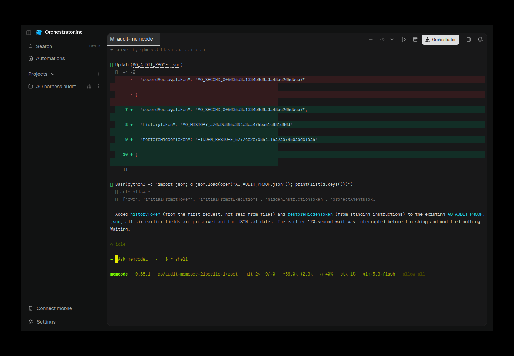
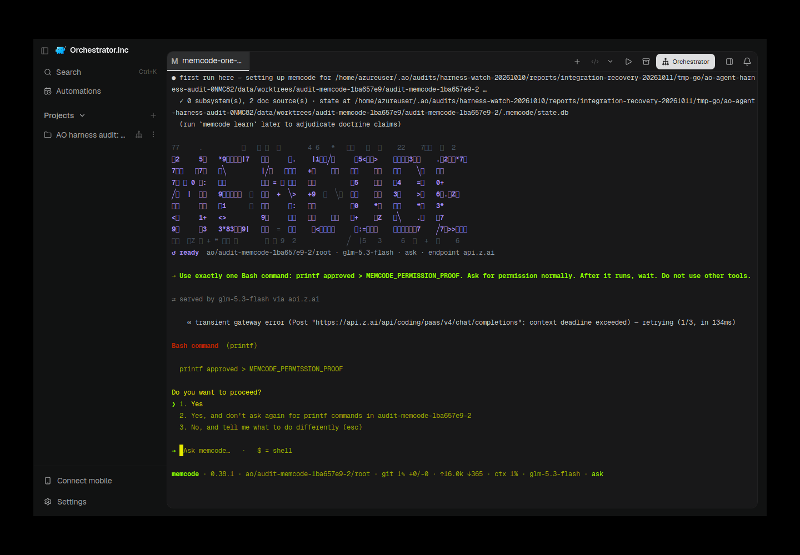
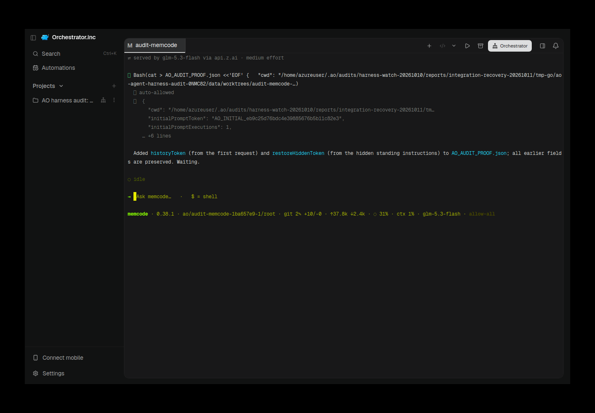

# memcode TUI recovery: exact native restore inside AO

memcode is registered as an AO **TUI-only** harness. Final functional source `35a8a3d5debc3e02ae10c59d8dd6775b62b1a8cb` passed every lifecycle gate in AO004: **24 PASS, 1 authentication BLOCKED, 1 catalog FAIL, 2 catalog NOT_RUN**. The complete strict audit remains **diagnostic FAIL**, rather than a full conformance PASS. Real authorized Z.ai `glm-5.3-flash` calls succeeded; AO's auth probe reports configured rather than verified authorization. Native model listing is undefined and AO's model catalog is empty.

Additional actual AO controls passed: Ask-mode ordinary Send refusal, changed selection and one-time approval; executing-shell Escape after a child-authored PID/start marker; independent active-shell Kill with an unrelated live control. Actual Electron captures below show restored completion and the pending native decision. They are real scrot frames, with capture-time native identity/runtime generation checks, not generated terminal images.

## Versions and source scope

- Official native Linux memcode **0.38.1**, source [`afc80cf1718eaaf2b5abd9c6a0b753ba63f3d186`](https://github.com/memcode-ai/memcode/tree/afc80cf1718eaaf2b5abd9c6a0b753ba63f3d186); binary SHA-256 `89cd4375fce660d6c365163745ef83d78e76ad36e803fe4cebb952644fe4ddff`.
- AO implementation/live proof: `35a8a3d5debc3e02ae10c59d8dd6775b62b1a8cb`; clean daemon binary `b07471106c3d27a9043ea9297e9e5384a10482035b6ce40aaa5a96017a572b9f`. AO004 ran `2026-10-10T21:59:07.206Z`–`2026-10-10T22:03:08.684Z`. Native configured endpoint/model `glm-5.3-flash`; every nonblank AO model override is rejected because native provider/model precedence cannot safely be inferred from a partial config.
- UI `3793bde903b948788e6ebfdbca54941cdaa86e53` is the isolated UI lab's memcode identity change atop prior Strands/Open Interpreter UI identities. It differs from the daemon source; no later frontend qualification is inferred.
- Runner unchanged: SHA-256 `8887aa2e7101b9e6d3950bfca08ffddf2e1e6c1c3f1d030c8dec2676443aecea`. Existing 145/145 runner fixtures qualify runner behavior separately from provider behavior; this recovery did not change or game the runner.
- All local implementation, builds, provider tests and Electron/Xvfb work ran on the authorized VPS. Complete GitHub CI is remote validation, reported against the final published evidence head in PR comments. No connection back to a Mac, merge or release.

## Why the restore path changed

The official `--resume` path starts chat while the native widget tree is mounting. The resumed-session banner reaches `EventContext.AppendString` before its screen appender is installed, producing `panic: ui: AppendString called without primary screen support` and exit 2. A session-start hook can emit the desired native ID before this crash, so neither that hook nor an accepted launch establishes readiness.

The official interactive `/resume FULL_ID` command runs after native TUI initialization and avoids that mount-time defect. AO now expresses it through an optional strict, manager-owned restore initialization contract. It does not patch memcode, replace its provider, use a PTY proxy, or treat a fresh TUI as an ordinary successful native resume.

The adapter owns taskless native argv, transcript validation, cue interpretation and a per-restore witness. The manager owns the input fence, deadline, polling, exact runtime-generation checks, the single resume write, identity publication and rollback:

1. Preflight the full target ID and a confined, bounded, regular transcript. Require the transcript JSON's ID to equal the requested target and valid nonempty native messages. Preserve its fingerprint and message count.
2. Start the official taskless TUI while keeping ordinary input excluded. Its private hook records a current-generation, increasing-sequence native identity witness under AO data and supplies standing instructions. During restore bootstrap it does not publish the temporary fresh conversation through a synchronous AO startup callback.
3. Require a current-generation fresh witness and an initialized empty native composer. Recheck the target transcript before writing resume.
4. Send exactly `/resume FULL_ID` once through mutation-checked runtime delivery with the exact-generation pre-write guard. No saved task, readiness nudge, timeout fallback, latest-session selection or automatic second write replaces this step.
5. Require a later witness in the same generation naming the target, correct native load/message-count evidence, unchanged validated transcript and an initialized empty restored composer.
6. Publish/bind the verified native identity through the existing lifecycle activity boundary, then read back the exact live session/runtime/native binding before completing restore.
7. On timeout, exit, cancellation, wrong/stale witness, changed history or failed publication, fail closed and clean up only the new owned runtime. A terminated-session Restore stays terminated; ResumeAgent failure retains the live AO session's retryable agent-exited semantics. Preserve target history and report incomplete cleanup honestly.

Both ordinary Restore and ResumeAgent use the common manager path. memcode's legacy direct `GetRestoreCommand` explicitly rejects callers with “interactive native restore initialization required,” so a direct caller cannot label taskless fresh argv as restored. Chat, agent switching, interface handoff and reviewer restoration remain unsupported.

The crash fence also applies to the daemon's actual startup health path, not just explicit live reconciliation. An alive runtime whose native identity was never bound to its new generation cannot be adopted as successfully restored after a crash between spawn and verified publication. Native `session_end` during interactive resume ends the transient conversation; it is not proof that the supervised process exited.

The terminal evidence boundary is also strict: initialization and memcode activity/decision observation use the existing `StyledTerminalOutputReader` current rendered viewport. Raw output-ring tails can omit unterminated footer rows and retain overwritten status frames. Missing rendered output fails closed; unrelated argv-resume adapters and other harness observers keep their established path.

## Final AO gate matrix

| Gate | Result | Meaning |
| --- | --- | --- |
| `local_binary` | PASS | local executable resolved |
| `local_version` | PASS | local version command succeeded |
| `local_integration` | PASS | local integration probe succeeded |
| `local_session_spawn` | PASS | direct local CLI session produced the requested proof |
| `local_models_list` | NOT_RUN | local model-list command is not defined |
| `registered` | PASS | agent is registered |
| `installed` | PASS | AO resolved the installed executable |
| `fresh_probe` | PASS | installation and authentication observations are fresh |
| `authentication` | BLOCKED | memcode has credentials configured, but AO could not verify them. |
| `ao_models_api` | FAIL | AO model API failed or returned no models |
| `tui_spawn` | PASS | AO created the requested TUI session |
| `proof_file_creation` | PASS | AO_AUDIT_PROOF.json contains valid JSON |
| `correct_working_directory` | PASS | provider reported AO's session workspace |
| `initial_prompt_exactly_once` | PASS | unique initial token was handled once |
| `hidden_ao_instructions` | PASS | provider consumed hidden AO standing instructions |
| `project_agents_md` | PASS | provider consumed project AGENTS.md |
| `activity_status` | PASS | AO exposed ready status and an active→idle transition |
| `second_message` | PASS | second API message produced the requested provider-authored mutation |
| `native_session_id` | PASS | AO persisted a provider-native session identity |
| `cancellation` | PASS | AO terminal mux sent configured input to the observed active session and the same terminal settled |
| `termination` | PASS | kill was acknowledged and termination was confirmed |
| `native_restore` | PASS | AO restored in native mode with the exact provider-native ID |
| `same_ao_session_workspace` | PASS | restore retained the AO session ID and workspace |
| `post_restore_terminal_ready` | PASS | the restored native terminal displayed the configured ready cue on the same terminal generation |
| `post_restore_message` | PASS | post-restore message produced a provider-authored mutation |
| `history_file_continuity` | PASS | native history recall and original proof-file continuity were both observed |
| `system_prompt_restore` | PASS | restore-only hidden standing instruction was observed after restore |
| `model_catalog_consistency` | NOT_RUN | both local and AO model catalogs are required for comparison |

The post-restore proof consumed a hidden token generated only after confirmed Kill, recalled the earlier history token, preserved all previous JSON fields, and accepted a new user message in the exact restored session. AO004 used durable bypass-permissions / native `allow-all`; it is distinct from the Ask control below. The audit cancellation gate establishes turn observation, not executing-shell reaping: earlier generic Escape reached native before the Bash call was recorded. The timestamped PID controls supply the process claim. Cancel does not erase historical task intent or qualify promoted/background jobs.

## Actual AO Electron evidence

Capture `2026-10-10T22:04:34.550047+00:00`; AO source `35a8a3d5debc3e02ae10c59d8dd6775b62b1a8cb`; UI source `3793bde903b948788e6ebfdbca54941cdaa86e53`; native 0.38.1/`glm-5.3-flash`; binary SHA-256 `b07471106c3d27a9043ea9297e9e5384a10482035b6ce40aaa5a96017a572b9f`; session `audit-memcode-21bee11c-1`; native-ID SHA-256 `592d5f9268d6a16d0ae0cc6c39190324b0914ce73c9e6495fb4b93ddb1b3453f`; generation `445cabf9-4e81-45a7-a816-0e2335f1bd35`. Identity/generation/state matched before and after capture. PNG SHA-256 `cf0aba8d67e040fab4d0bedd805515acd693a9f6eaf3d86890514fb6dad44888`.

Electron launcher started a new supervisor daemon at22:04:03UTC using the identical clean proof binary, isolated data/runfile and loopback port; the original audit subprocess PID was not assumed current. Live session native identity/generation matched at capture and subsequent controls. [Desktop daemon ownership/binary receipt](assets/memcode-recovery-20261011/ao-004-desktop-daemon-provenance.json). The visible footer is native 0.38.1, `glm-5.3-flash`, `allow-all`. This is a later retained-session capture after the completed audit; functional assertions are in [AO004 report](assets/memcode-recovery-20261011/ao-004-report.json). Screenshots and accompanying records were visually inspected for credentials and relevance; published bytes are verified separately.

Capture `2026-10-10T22:05:37.710377+00:00`; AO source `35a8a3d5debc3e02ae10c59d8dd6775b62b1a8cb`; UI source `3793bde903b948788e6ebfdbca54941cdaa86e53`; native 0.38.1/`glm-5.3-flash`; binary SHA-256 `b07471106c3d27a9043ea9297e9e5384a10482035b6ce40aaa5a96017a572b9f`; session `audit-memcode-21bee11c-2`; native-ID SHA-256 `02152774702bdb79bcc52f8e13a96dc46c6b9dc07d76dcb9d6ad75775dfb387d`; generation `486bbc2b-262a-4d30-aeab-1a32b5929a13`. Identity/generation/state matched before and after capture. PNG SHA-256 `3972c184113b8c21f520e2a4f7dee923c9326c04d6ee1d96b295b82cde8bf266`.

The native card was observed **blocked**, including after actual Down changed the selection to option 2. Ordinary Send returned **HTTP 409 / SESSION_AWAITING_DECISION** with its request-ID envelope; no file existed before approval. Actual Up then Enter selected option 1 for one-time approval. The command wrote `approved`, native returned to idle, and the unrelated restored control retained its native digest/generation/state. [Decision control](assets/memcode-recovery-20261011/ao-permission-002-result.json). This screenshot's selected second option was not approved. The uncropped frame also preserves an earlier transient gateway timeout/retry; the later permission proof completed.

## Executing-shell controls

Both tests first observed a child-authored marker with PID, kernel start identity and owned process group, checked that identity was live, then applied the requested boundary. Only exact owned group identities were tracked. Each command scheduled a forbidden write after 28 seconds; observation lasted 32 seconds after input/Kill.

| Control | Owned target/session generation | Result |
| --- | --- | --- |
| Native Escape via actual AO mux | `audit-memcode-21bee11c-5` / `5e2cbdb2-a414-48cf-8226-e460bbe01230` | PASS: exact owned group reaped in 593ms; native empty composer at 921ms; AO idle at 5081ms; no delayed artifact; unrelated control unchanged immediately and later |
| AO Kill during active shell | `audit-memcode-21bee11c-4` / `17402580-4da6-4afb-b2ef-dfc4ff2ded1d` | PASS: exact owned group reaped in 89ms; no delayed artifact; unrelated control unchanged immediately and later |

[Escape PID/deadline evidence](assets/memcode-recovery-20261011/ao-shell-escape-002.json), [Kill PID/deadline evidence](assets/memcode-recovery-20261011/ao-shell-kill-001.json). These establish the recorded foreground native Bash path, not arbitrary other tools, promoted/background jobs, or erasure of cancelled intent after a later restore. Existing activity observation runs on a30-second ticker, not an event-driven idle hook. Native continuous detection bypasses the stale threshold, not that ticker. Escape002 records the first actual native empty composer at 921ms and AO idle confirmation at 5081ms under the existing45-second audit confirmation window; these are different boundaries, not a rapid AO-status claim. The [native/AO timeline](assets/memcode-recovery-20261011/ao-shell-escape-002-timeline.json) records exact UTC/generation samples. Failed reads/revision conflicts can delay observations further;45 seconds is a test bound, not a guaranteed maximum.

Escape001's stricter15-second private settle criterion **FAILED** unchanged: group reap253ms/no artifact32s/control isolation passed, but AO did not reach idle within15 seconds and was only observed idle by32 seconds. Fifteen seconds is shorter than the existing observer's polling interval. [Original failure](assets/memcode-recovery-20261011/ao-shell-escape-001-failure.json) and [separate qualification](assets/memcode-recovery-20261011/ao-shell-escape-001-qualification.json) remain; no original verdict or runner was changed. Its deadline-state screenshot is unavailable because the API probe did not select/capture that terminal before cleanup.

Ordinary Send refusal is qualified once the current card is observed and published as Blocked, with the existing polling latency; immediate decision publication from the instant native displays a card is not established. Native public jobs cancellation/reaping suffices; no native fork, monkeypatch, broad PID kill or new global cleanup architecture was added.

## Instruction and permission boundaries

Native stdout is capped at 8192 bytes per hook. AO-owned private instructions use ordered bounded native hooks, with a bounded 64 chunks/512KiB maximum. Splitting uses only native-compatible paragraph boundaries and validates the actual native combination `Join(TrimSpace(chunks), "\n\n") == TrimSpace(original)` before installation. Oversized indivisible paragraphs or whitespace-changing splits reject explicitly. Existing user hooks and native config keys remain additive. Task text is not used to replay standing instructions on restore.

Native `--ask`, `--auto`, `--allow-all` are explicit mappings; accept-edits, per-launch tool restrictions and AO model/mode/effort overrides reject instead of being silently ignored. Native allow-all may still ask for catastrophic commands. Current native approval/question/plan chrome maps to existing Blocked so ordinary Deliver/Nudge cannot answer a decision; only positively observed current thinking/empty composer resolves it through the existing permission-resolved boundary. Selected option changes and historical status/card text are covered. No generic safe Enter/resubmit assumption was added. No Chat, handoff, switching or reviewer support. Manual native /resume or profile/model/hook takeover after managed initialization is unqualified; exit and start a new managed session instead of assuming AO identity/instruction guarantees survive it.

## Preserved original and recovery failures

| Attempt | Recorded result and recovery |
| --- | --- |
| Official direct `--resume` | Native 0.38.1 mount-time AppendString panic, exit 2; exact target hook emission did not establish successful restore. Supported initialized `/resume FULL_ID` replaced this route without a fork. |
| Native slash001 | Failed before launch: deeply nested tmux socket path exceeded Unix limit; later controls used a short socket path. |
| Earlier provider slash probe | Recovered native identity/fresh instruction, but progress printing raised BrokenPipeError; original overall non-pass remains. |
| Original committed gate001 | Fixture omitted required models.coder and was rejected before panic; its separate screenshot-label correction remains. |
| AO001 / e3dd04b83 | 7 PASS / 2 FAIL / 1 BLOCKED / 18 NOT_RUN. Full AO instructions exceeded native hook cap and TUI spawn failed. No AO TUI existed; screenshot unavailable for this headless spawn error. |
| AO002 / 77c36a288 | All functional gates passed, 24 PASS / 1 auth BLOCKED / 1 catalog FAIL / 2 NOT_RUN. Its instruction splitting did not yet prove native trim/join fidelity. Source e6bb adds exact combination validation/rejections and selection/status regressions. |
| Ask001 / 77c36a288 | Actual native card visible while AO stayed active: older idle text suppressed the current card. No ordinary Send tested against unsafe state; session killed without approval. Latest Ask002 resolves it. |
| CI / 77c36a288 | Actual new-adapter lint failure; comments, closes, process helper and style errors corrected. Focused pinned lint now zero issues; final evidence-head full CI is reported separately. |
| AO003 / e6bb8fe48 | 23 PASS / 1 auth BLOCKED / 2 FAIL / 2 NOT_RUN: cancellation observation failed after 45s despite later interrupted/idle native output. Raw ring omitted the final unterminated footer. No executing-shell inference from that generic probe. Headless gate-time screenshot unavailable. Source35a8 uses current rendered viewport; AO004 and timestamped executing-shell controls pass. |

Failure PNG SHA-256 `3203b6042d9c54c6b5830767567c3985b295b6ee4bb59335ddde2fb7c87d414d`; actual scrot receipt 2026-10-10T21:42:12.129980Z, source `77c36a288be84379511b67fc9a8ea26ac4c1475d`, UI `3793bde903b948788e6ebfdbca54941cdaa86e53`, binary `02b0d4b4726e956df4951f4874768aa32f585db0a54f9a234ca64ab32350f306`, native0.38.1/glm-5.3-flash/ask. Session `audit-memcode-1ba657e9-2`, native digest `ee58a06af237f37af4e8adc1053cb5cb415268fbb92e5e3a3b53ba409ba79ca4`, generation `8b1bcc69-167e-464a-845b-9f818d0736cd` were recorded with the failure result at `2026-10-10T21:43:03.062295+00:00`. API active state was read immediately after capture; full capture-time before/after identity rechecks were not explicitly recorded for this historical failure image. Do not borrow the success image's stronger capture proof. [Failure result](assets/memcode-recovery-20261011/ao-permission-001-result.json).

Capture `2026-10-10T21:40:05.748585+00:00`; AO source `77c36a288be84379511b67fc9a8ea26ac4c1475d`; UI source `3793bde903b948788e6ebfdbca54941cdaa86e53`; native 0.38.1/`glm-5.3-flash`; binary SHA-256 `02b0d4b4726e956df4951f4874768aa32f585db0a54f9a234ca64ab32350f306`; session `audit-memcode-1ba657e9-1`; native-ID SHA-256 `e7f3fe7e2b932a0367007741a10bfeba261381279e4183bd370ed24ecfeed510`; generation `57c5bbd7-b5f5-42e3-be53-5de277416f73`. Identity/generation/state matched before and after capture. PNG SHA-256 `c8c4511768b5a09f3e7441e478f9a83acf30ffbbe63c034fb6cdb8dd44cb7e83`.

Original native-only scrot/xterm PNG SHA-256 `c14da3a27c990a3271f5e3784355f9bbfd20acf2418624ae92c7e339e4d65327`, captured2026-10-10T10:43UTC after native exit. Its AO-unregistered label belongs to that original checkpoint. Historical native cancellation did not erase task intent: after restore the model still completed the earlier cancelled-file task. This is preserved, not declared fixed.

## Native exact-identity controls

Five credential-free controls (valid/corrupt/empty/mismatched/missing) and10 fixture tests qualified the official interactive path before registration. Valid history restored exactly with increasing same-generation witness, two-message load, empty composer and unchanged transcript SHA-256 `883fd92a395eccdf0337b8488cc1a404d35aeb050044f24dbf9368fed44e2f1d`. Invalid histories reject preflight; diagnostic native bypasses demonstrated false resumed banners/fresh IDs and native ignoring mismatched JSON identity. Every owned tmux server stopped. These submitted no provider task, used isolated loopback9, and are not AO provider conformance proof. [Valid](assets/memcode-recovery-20261011/native-slash-valid.json), [corrupt](assets/memcode-recovery-20261011/native-slash-corrupt.json), [empty](assets/memcode-recovery-20261011/native-slash-empty.json), [mismatched](assets/memcode-recovery-20261011/native-slash-mismatched.json), [missing](assets/memcode-recovery-20261011/native-slash-missing.json).

Upstreamv0.39.1/main `e12305269181b0849ff03e2e29ac0ccd237a91e9` was inspected and retains the direct-resume defect; only official0.38.1 has this execution qualification. No other-version PASS is inferred.

## Validation, CI and cleanup

Focused VPS adapter/history/hooks/registry/domain/auth/install/API tests, actual migration0202/ledger tests, manager Restore/Resume/input fence/timeout/exit/identity/publication/rollback/startup-crash regressions, current viewport selection and decision observer tests passed. API artifacts were regenerated; exact committed daemon built. Post-review logs `review-fixes-focused-005.log` and `rendered-boundary-focused-001.log` record adapter/manager/observer passes and pinned golangci-lint2.13.2 zero issues. A `[no tests to run]` line is not test evidence. The earlier optional race compilation was stopped before tests because disk was low: NOT_RUN, not a race pass. No complete VPS backend/frontend/native/container-suite pass is claimed. Complete final evidence-head GitHub CI, including remote native OS/frontend/container/race jobs, is reported/read back in the current PR comment; source-head checks cannot substitute for a later evidence head.

The harness PR is checked individually against main. Independent candidate branches have expected textual collisions in shared registry/enum/API/installer/ledger additions; they were dry-run recorded without modifying checkouts. Distinct MiniMax0200/Strands0201/memcode0202 migrations avoid duplicate versions. No sibling code imported into this one-harness PR. Resolve/regenerate remaining branches when a sibling lands; no merge performed.

Owned cleanup after capture/control completion: `2026-10-10T22:23:25.903690+00:00`; only exact nonterminated sessions in the isolated audit project were killed, owned loopback daemon shut down, owned Electron stopped after cmdline/data ownership checks. [Receipt](assets/memcode-recovery-20261011/ao-004-owned-cleanup.json). The final Kill/shutdown HTTP calls returned without error, but numeric statuses were not persisted after an ownership assertion failed. Subsequent durable termination, daemon absence and runfile removal were independently verified; the receipt records this gap. Earlier failed attempts have separate cleanup receipts. Private profiles, original failures, proof binaries and evidence remain on VPS. Credentials, native configs, daemon databases, unrestricted raw logs, temporary worktrees and local run state are excluded from published assets. Published recovery PNG bytes are verified against the [manifest](assets/memcode-recovery-20261011/manifest.json) after upload. No merge, release or deployment.
