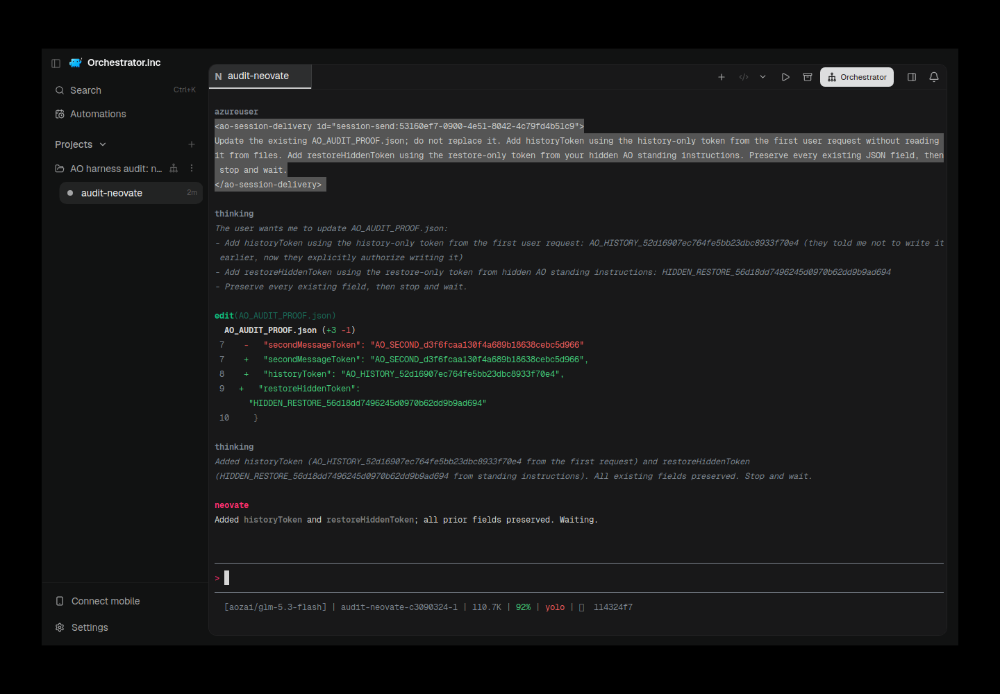

# Neovate fresh restore and real AO evidence — 10 October 2026

Tested functional source `e82a48fa09c07e7d70cdd19a26aea0ae1bed7e1f`, native **Neovate Code 0.28.5**, Z.ai `aozai/glm-5.3-flash`, explicit audit bypass/yolo. Current installed runner SHA-256 `8887aa2e7101b9e6d3950bfca08ffddf2e1e6c1c3f1d030c8dec2676443aecea`. All computation/live calls/real Electron capture on the authorized VPS. Evidence-only follow-up; no production source change.

Fresh neovate-001: **25 PASS, 0 FAIL, 1 BLOCKED, 2 NOT_RUN**, finished `2026-10-10T18:37:20.725Z`. Functional lifecycle successful; strict overall **BLOCKED / diagnostic-only**. Adapter credentials remain configured, not verified. Native model listing and native/AO comparison remain NOT_RUN. No login or relaxed contract.

Fresh restore-only standing instructions were introduced **after confirmed termination**, written/read back through the project API, then consumed after exact native-ID/workspace restore. The end-anchored native cue requires an empty `>` composer and the configured model/exact audit workspace footer. Same identity, restored readiness, post-restore mutation and history continuity passed. This supplies fresh evidence missing from the historical 17/17 run, whose token was present from the initial turn. Historical labels are preserved, not retroactively endorsed. [Original failure report](https://github.com/OrchestratorInc/agent-orchestrator/pull/6494#issuecomment-6095922325) retains the early-send unsubmitted-draft failure and later native-composer control.

Cancellation is observed active-turn Escape through the exact native mux and settled AO state, not a claim that an already-running subprocess was reaped. Instruction consumption does not promise confidentiality: screenshot shows harmless audit-only tokens echoed by the model.

Actual AO Electron, real preload bridge, exact session route, tested source UI. Captured `2026-10-10T18:39:19.976133Z` with scrot/Xvfb; PNG SHA-256 `b082322cfc46f9faace73554c01a54c5ef817a69ee4e41e972d8ef754ee68cfc`. AO session `audit-neovate-c3090324-1`; native digest `b9fb3eadd73e423e648ee1959b17b836afcae16183298fd7119ec281e8316a35`. Exact native digest and terminal generation reconfirmed against the functional audit. Image visually inspected; no credential visible. Model and workspace footer are visible. Adjacent provenance contains exact AO executable/source/UI hashes and capture daemon identity.

The finalized runner was stopped to release compute lock; Electron supervisor reopened the identical isolated data using the exact tested binary and recovered the native runtime. This is retained-session capture at its own timestamp. Original gate-time auth screenshot unavailable: preflight had no session; historical native mirrors remain native mirrors.

Validation: original exact functional head **24/24 GitHub CI successful**. No unnecessary huge backend race rerun or frontend tsc/OOM retry for documentation/assets only. Final evidence-head CI recorded separately in the published report. Linux VPS does not claim local macOS/Windows verification.

Cleanup: session API-killed and termination confirmed. First cleanup safely rejected a GPU PID as the Electron main process, and daemon graceful shutdown had not finished after2s; incomplete record retained. Exact main Electron and current run-file daemon executable verified before TERM; final both gone. One GUI-created scratch auth PTY host remained after daemon shutdown; its exact executable/scratch args verified and terminated, gone. Original reports/profiles/provenance binaries retained; no unrelated processes or regular AO data touched.
