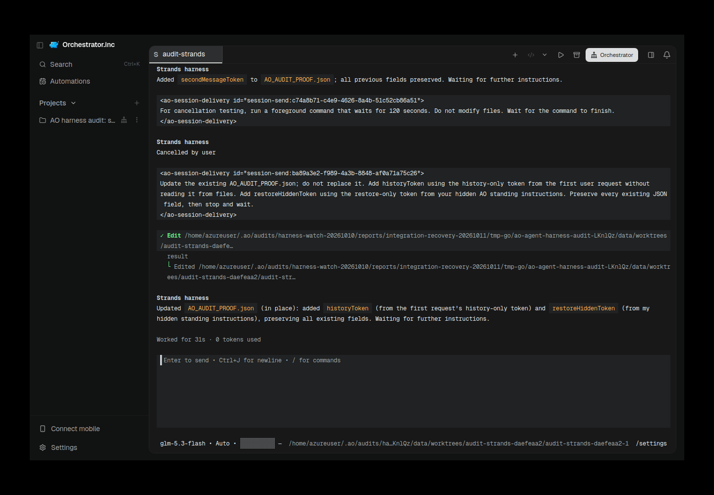
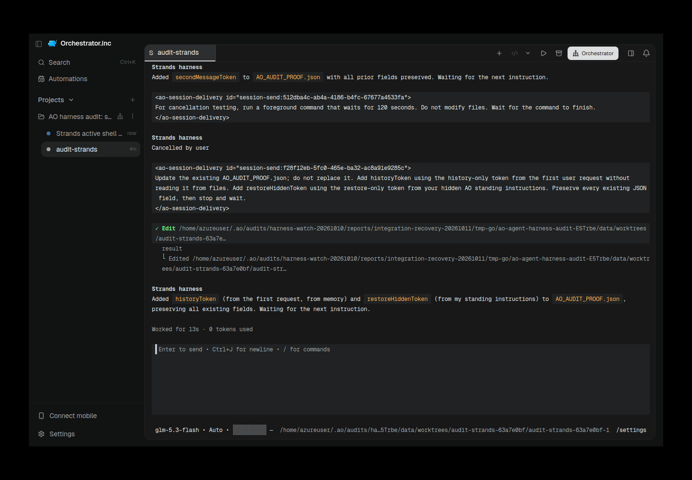

# Strands CLI recovery: integrated AO TUI, functional proof and diagnostic gaps

Strands is now registered as an AO TUI harness on the integration branch. The final supported-profile audit, `ao-003`, passed all functional lifecycle gates at source `98365b809f8378f642f09d711eb727654a86090d`: initial delivery exactly once, private and project instructions, activity, second message, cancel, Kill, exact native-session restore, an initialized empty restored composer, history continuity, and fresh instructions introduced after Kill.

The audit remains **diagnostic FAIL: 24 PASS, 1 authentication BLOCKED, 1 AO catalog FAIL and 2 catalog NOT_RUN**. Configured credentials are not verified authorization, and successful provider turns do not turn an absent native model-list command into a catalog. The earlier unregistered status and cancellation failures below are historical evidence, superseded only for the supported configuration tested here.

Final implementation source: `cf448df56e144623fe13cafcdf27c71bb3fa672b`. Live functional proof remains pinned to `98365b809`; later commits reject unsupported saved subagent modules and record migration0201 in the shipped ledger. Complete exact evidence-head CI is recorded in the published PR follow-up; this report makes no earlier-head/full-suite substitution.

## Native version, provider and source boundaries

- Official executable/package: `strands`, `@strands-agents/cli@0.2.0`; installed `@strands-agents/harness@0.1.1` and `@strands-agents/sdk@1.20.0`.
- Native upstream: [strands-agents/harness-sdk](https://github.com/strands-agents/harness-sdk), `harness-cli/v0.2.0`, commit `e519d67021b9c009e56e9309edcd94ab87e7156e`. Entrypoint SHA-256: `987e32867f74496f26075d4e5a59d1f7af291162650d2db73b277be7fbd949a0`.
- Linux VPS, Node 24.21.0. All source compilation, SDK/native tests, real provider calls, daemon execution, Electron and capture ran on the authorized VPS. The laptop carried SSH traffic only.
- AO audit provider: real Z.ai Coding Plan `glm-5.3-flash`, selected in native Strands as `litellm/glm-5.3-flash`. A private loopback HTTP transport relay connected the native provider to the authorized Z.ai endpoint. It did not simulate model responses. Credentials remained in the authorized private wrapper/environment, outside source, argv, public reports and screenshots.
- Earlier native controls used Strands' official `modelModule` with the shipped `OpenAIModel` against the authorized endpoint. That setup established real native execution but remained auth-unknown to AO. It must not be described as the later built-in-provider AO profile.
- Native cancellation controls accepted the exact disposable shell command once under native default permissions. AO003 durable `session_permissions` is `bypass-permissions`; the native UI displays “Auto”. These are distinct from the native one-time-approval controls.
- Functional daemon source: `98365b809f8378f642f09d711eb727654a86090d`. Binary SHA-256: `7eb497daf80994fd2f710cdb70725f0d754aa64c2c0b9ae489a24d56b5ad3ab1`.
- Actual Electron UI source: `878957f4583fbe7762ebef29708a0f79a61acc5d`. This is a different UI revision; the screenshots do not qualify frontend changes made after that UI source.
- Audit runner SHA-256: `8887aa2e7101b9e6d3950bfca08ffddf2e1e6c1c3f1d030c8dec2676443aecea`.

The source and binary labels above come from `ao-003/source.json`, independently matched in the capture provenance. The guard-only diff from `98365b809` to `1b9caed8` changes three files: saved `profile.subagents` validation, one regression case, and product documentation (5 insertions, 3 deletions). Supported-profile provider proof remains attached to `98365b809`; guard validation and final CI must be attached to their own exact revision.

## What changed

The released SDK shell passed its timeout to the native sandbox without the tool invocation's cancellation signal. Escape/Ctrl+C could display “Cancelled” while a detached shell continued running and performed a late write.

AO's plugin now uses supported public APIs to replace an existing native shell with a cancellation-aware shell. It retains the official `makeShell` schema, validation, output and errors, and forwards `ToolContext.cancelSignal` through a small public `Sandbox` subclass to the CLI's existing `WorkspaceSandbox.execute`. That native sandbox performs process-tree cancellation. There is no installed-native patch, global monkeypatch, private SDK access or alternate process runner.

Replacement is deliberately conditional: `toolRegistry.get("shell")` must already find the selected shell. A narrowed child or an agent with shell disabled gains no new tool. A guard records the original selected shell before saved plugins initialize; later custom shell replacement and nondefault shell options are rejected rather than silently rewritten.

AO launches foreground tools with the exact public key `--set agentConfig.backgroundTasks=false`. Native `strands_config` is removed through the public tool registry on initialized agents so model-driven profile reload cannot drop AO plugins/private instructions or re-enable background dispatch. Because the SDK registers the background manager after consumer plugins, the activity plugin checks for its public `strands_manage_background_task` tool at `InitializedEvent` and again before invocation. It does not read a private or nonexistent background-task field.

Managed roots are identified through public native session identity and session-manager presence. Same-session root rebuilding rebinds the activity hooks; a different managed native session or workspace is rejected. Default child activity does not settle the root turn.

The integration also adds the normal AO harness identity/registration, activity routing, installer and readiness/auth handling, model-entry behavior, migration `0201`, generated API artifacts, and product documentation. Native snapshots and the launch-to-workspace locator live under AO data. Restore validates the existing native checkpoint and exact native ID/workspace before launch; Strands otherwise silently starts a fresh conversation for a missing ID. Saved domain instructions are combined with AO's current private instructions, and restore resolves them again.

## Final AO audit and active-shell controls

`ao-003` ran from 2026-10-10T20:58:12.221Z to 21:00:14.927Z. Session: `audit-strands-daefeaa2-1`. The report's top-level “one agent FAIL” is an agent count; the following 28 gate results are the relevant conformance counts.

| Gate group | Result |
| --- | --- |
| Native binary/version/integration and direct local proof | 4 PASS |
| AO registered, installed and fresh observations | 3 PASS |
| Authentication | BLOCKED: configured, not verified |
| Native model listing | NOT_RUN: no native listing command defined |
| AO model catalog | FAIL: HTTP 200 with an empty model list; direct text model entry remains available |
| Catalog comparison | NOT_RUN: both catalogs are required |
| TUI spawn, proof JSON and exact working directory | 3 PASS |
| Initial prompt exactly once, private instructions and project AGENTS.md | 3 PASS |
| Active-to-idle activity, second message and persisted native identity | 3 PASS |
| Configured cancellation input and confirmed AO termination | 2 PASS |
| Exact native restore, same AO session/workspace and initialized empty composer | 3 PASS |
| Post-restore mutation, history continuity and fresh post-Kill private instruction | 3 PASS |

The refreshed instruction was introduced only after confirmed Kill, then observed after restoring the same native history. It was not merely an old instruction recovered from the transcript. Audit fixture tokens prove consumption; model echo of those fixtures is not a confidentiality guarantee.

The generic audit cancellation gate proves mux input reached an observed active terminal and that the same terminal settled. Independent controls establish stronger running-shell behavior:

| Control | Result and scope |
| --- | --- |
| Native Escape `native-escape-004` | PASS: actual started shell reaped in 210 ms; native turn settled in 400 ms; composer survived; no delayed artifact during the 32-second observation. This is corrected foreground-launch evidence preceding the final config-tool guard. |
| Native Ctrl+C `native-ctrl-c-005` | PASS on the final production plugin: started shell reaped in 97 ms; settled in 210 ms; composer survived; no delayed artifact over 32 seconds. |
| AO active-shell Kill `ao-kill-active-003` | PASS on the final functional daemon: Kill acknowledged, owned shell reaped in 389 ms, still absent after the observation window, no late artifact. An unrelated idle control survived immediately and later with the same generation. |

Kill003 target: `audit-strands-daefeaa2-3`; generation `42661648-7020-4fcf-9e42-377ec35b9267`; retained native-ID SHA-256 `013a46bcd0ed7df53a27c1016937fd3acb70330e46dfb5163d5518d5413d4122`. The control was the restored audit session `audit-strands-daefeaa2-1`, still idle at generation `1dcba694-ef1b-4c71-83c2-513d5c691724` immediately after Kill and at the later capture. This establishes isolation for Kill003. Exact restore was independently demonstrated by AO003; no second exact-restore pass is inferred for the killed Kill003 target merely from retaining its history identity.

## Actual AO screenshots

These are real `scrot` captures of isolated Electron on the VPS, with the native preload bridge and owned daemon/session checked. They are later retained-session captures, not screenshots taken at the original audit gates. The successful images visibly show AO context, the native restored completion and an initialized empty composer/model. Root independently inspected both success and failure images. They are not terminal text rendered into generated images.

### Final supported-profile session

Capture: 2026-10-10T21:08:21.227532Z. Daemon source `98365b809f8378f642f09d711eb727654a86090d`; UI source `878957f4583fbe7762ebef29708a0f79a61acc5d`; daemon binary SHA-256 `7eb497daf80994fd2f710cdb70725f0d754aa64c2c0b9ae489a24d56b5ad3ab1`. Native CLI 0.2.0, `litellm/glm-5.3-flash`. AO session `audit-strands-daefeaa2-1`; native-ID SHA-256 `750f2289056d635ce4330cd6fcbf0002731214db6e9dbfcb0c8c7d4e86863ee8`; restored generation `1dcba694-ef1b-4c71-83c2-513d5c691724`. Both before/after reads reported the same session, native digest, generation and idle state. PNG SHA-256: `ffae74a4e45becc91b11c019c8ece1ee128a2aa7c8651ab992c8b84e1b442303`.

### Preserved real Electron startup failure

Capture: 2026-10-10T21:03:59.342051Z. The image shows a blank white Electron window. Process logs/provenance identify `pthread_create` failure under the worker's own service `TasksMax=256`; the image alone does not diagnose the cause or demonstrate initialized harness UI. Daemon source/binary and UI source match the labels above. PNG SHA-256: `c76ba77e564904b5811a937819415c8f2adeab1045f8b51b08cf6422ca6777fd`.

Recovery stopped an older owned AO002 daemon and raised only `ao-harness-integration-recovery-20261011.service` from `TasksMax=256` to 512. It did not add host RAM or change CPU/memory allocation. The worker retained its serial compute lock and relaunched its owned Electron instance.

### Earlier functional capture, preserved with its original source

Capture: 2026-10-10T20:51:35.033460Z. Daemon source `df54834f66e10bfa6aea900ecb6c6c12d159039e`; binary SHA-256 `551790c241e52f55e0ea8ad257b9b85cf323fe644a8a046d7164061fdae27c13`; UI source `878957f4583fbe7762ebef29708a0f79a61acc5d`. AO session `audit-strands-63a7e0bf-1`; native-ID SHA-256 `6d2d836e128d7603271fe94f25bc33ea4d0e61589ccd2f47b8698720d128cf63`; generation `9d5d3bbb-3308-4426-bdd6-b5877f487c62`, unchanged and idle before/after capture. PNG SHA-256: `3e3b464210effaddf534e2de6600f8bd044830d5d0c34dab8441af9d9f793a0d`. AO002 also recorded 24 PASS / 1 BLOCKED / 1 FAIL / 2 NOT_RUN, but does not qualify later source automatically.

## Failed attempts remain part of the record

- Unmodified released-native `native-003` Escape and `native-004` Ctrl+C showed “Cancelled” while the shell continued another 28.105 s and 28.090 s respectively, then wrote the forbidden artifact. The original shell/sleep identities, native hooks, terminal bytes and delayed files remain evidence. Separate native-only screenshot reproduction `native-005` remains labeled as such.
- The first cancellation regression launcher used the wrong installed CLI path (`cancellation-red-001.log`). The corrected RED showed the plugin lacked the cancellation shell; the subsequent GREEN exercised the real installed SDK/native sandbox.
- `native-escape-003` failed before shell approval/start because `--set backgroundTasks=false` is an unsupported top-level assignment. It is not a successful cancel/no-side-effect control. The corrected key is `agentConfig.backgroundTasks=false`.
- AO001 recorded 6 PASS, 1 BLOCKED and 20 NOT_RUN. Its custom model module left readiness/auth observations unsuitable for the fresh-readiness gate; it stopped before TUI spawn. Native listing was also NOT_RUN. Do not attribute this actual AO001 stop to the incorrect foreground flag: it never reached that launch boundary.
- The original migration number `0195` collided with concurrent Neovate work. Strands moved to new migration `0201` before final source qualification.
- AO Kill001 reaped its target shell in 685 ms with no late write, but the earlier AO002 control was later observed terminated without established cause. It does not establish cross-session isolation. Subsequent explicit owned cleanup does not retrospectively explain that earlier observation.
- AO Kill002 failed with `fetch failed` and remains FAIL. Neither its attempt nor the blank GUI003 capture is relabeled as success. Kill003 and GUI003b are separate successful controls.
- The former unregistered candidate's full VPS suite had failures outside its package. Those failures remain unproven as baseline; focused successes and new provider proof do not rewrite them into full-suite passes.

Preserved native-only images:

Their PNG SHA-256 values are `89dac2c9ff297f5f47e544ba21a72d183f21f583e29c2130fa0058aa76247cce` and `4faad8828d8375c8737dfb8db94a3ce2b688fcf3325c7e54df440cb3279e8b67`. They were captured during the earlier native-only reproduction, when AO integration had not been registered; their old visible labels describe that attempt.

## Supported scope and limits

This qualification covers the pinned native TUI, real provider/profile, supported shell/default children, and AO lifecycle tested here. Foreground-only operation is enforced. Custom tools, saved custom subagent modules, custom sandboxes/shell options, authored agent projects, and custom agent configuration/session-manager/root-ID overrides are rejected. A native model module may be preserved when no AO model override is requested; it does not become a verifiable AO login or a native catalog.

Ask Permissions requires native default permissions with no always-allowed tools. Bypass is accepted only when the user has explicitly configured native bypass already; AO does not write that setting. Other permission modes and per-launch tool restrictions lack a qualified mapping.

Explicit human `/setup`, `/tools`, and native profile/plugin reconfiguration inside an AO-managed terminal are unsupported and can remove the managed guarantees. Exit and start a new AO session after changing native configuration. The adapter does not claim activity, foreground-only behavior or exact restore remain valid after that takeover. Same-session root rebuilding with AO plugins still loaded is covered by the SDK regression; unrelated native session/workspace switching is rejected. Chat, ACP, reviewer mode, interface handoff, other native releases/providers and all native-platform combinations are not qualified by these Linux live runs.

## Validation, evidence and publication

Recorded VPS validation includes 4/4 real-SDK cancellation/configuration regressions, focused Strands/registry/system-install/auth tests, domain/activity/model-catalog checks, migration0201 validation, API regeneration and a clean-source daemon build. The SDK cases cover actual started-shell cancellation, no shell expansion for narrowed children, supported root rebinding, model-config tool removal and rejection of enabled background-manager configurations. The saved-subagent guard focused package passed at `1b9caed8a950937b516c1cf5b631a6a6a0f94264`; migration ledger and migration0201 focused tests passed after the `cf448df56` correction. These statements do not claim a full local CI-suite pass.

The retained `ci-current.json` snapshot belongs to `98365b809`, with checks still pending at that observation. Earlier CI snapshots at `71766fcc`, `df54834f` and `f921f91a` belong to superseded source. CI at `1b9caed8` exposed an actual `TestMigrationVersionLedger` failure because migration0201 was absent from its ledger. Commit `cf448df56` adds that entry. The final published PR comment records the complete checks at its exact evidence HEAD, including rerun conclusions. Native OS/frontend/container results must be attributed to CI, not to Linux VPS execution. Do not infer final success from an earlier green head.

VPS evidence root: `/home/azureuser/.ao/audits/harness-watch-20261010/reports/integration-recovery-20261011/strands/`. Primary files: `ao-003/report.json`, `ao-003/source.json`, `ao-003/ao-electron-restored.provenance.json`, `ao-003/thread-limit.provenance.json`, `ao-kill-active-003/result.json`, `ao-kill-active-003/control-later.json`, and native control `result.json` files. Original released-native failures remain separately under `reports/strands/`. Keep sanitized result/provenance files and exact real image bytes in the published evidence; private profiles, logs/databases with private values, credentials and temporary worktrees are not publication artifacts.

Owned Electron was stopped. At21:23:40UTC, the remaining nonterminated sessions in the exact isolated audit project were killed with HTTP200 and the owned loopback daemon shut down with HTTP202 (`ao-003-owned-cleanup.json`). Profiles, source, proof binaries and evidence remain on the VPS. The older owned AO002 daemon was explicitly stopped; capture-time evidence shows the final restored audit control was still idle/alive. Do not claim all processes are stopped until final ownership-checked cleanup is recorded. No merge, release or production deployment is established by this report.
