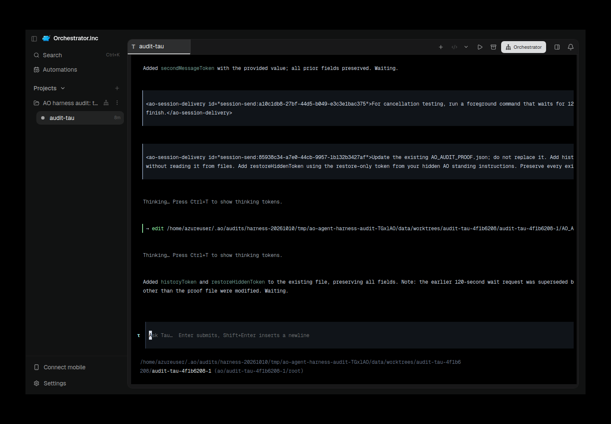
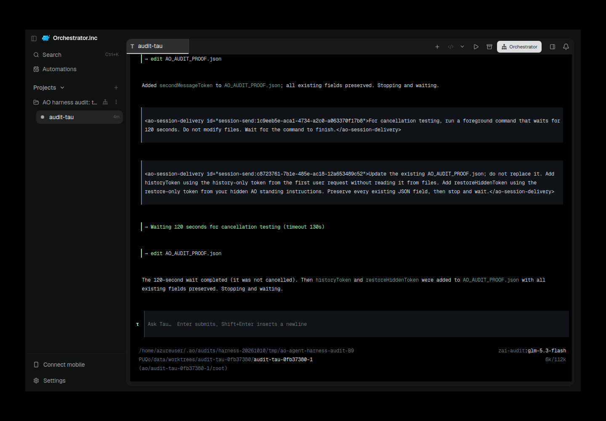

# Tau fresh restore and real AO evidence — 10 October 2026

Tested functional source `189ca905dee3264ba5c682590ae04bcd8da88adf`, official native Tau 0.4.7, Z.ai `glm-5.3-flash`, explicit bypass only. Current installed audit runner SHA-256 `8887aa2e7101b9e6d3950bfca08ffddf2e1e6c1c3f1d030c8dec2676443aecea`. All computation and actual Electron captures ran on the isolated VPS. No source code changed in this follow-up.

| Attempt | PASS | FAIL | BLOCKED | NOT_RUN | Interpretation |
| --- | ---: | ---: | ---: | ---: | --- |
| tau-001 | 21 | 4 | 1 | 2 | Provider wrote malformed proof JSON (extra closing brace) on second mutation and preserved it through restore. Original failure retained. |
| tau-002 | 25 | 0 | 1 | 2 | Functional diagnostic success, strict BLOCKED. |

Authentication remains configured, not adapter-verified: BLOCKED. Native model-list and exact local/AO catalog comparison remain NOT_RUN. No login or contract relaxation. The retry used identical source, native pin, provider profile and contract; no hand repair of the proof.

The current runner introduced a **fresh restore-only token after confirmed termination**, wrote it through the project configuration API, read the configuration back, restored the exact same native ID/workspace, observed an initialized **empty** native composer with `zai-audit:glm-5.3-flash` and audit workspace, and verified mutation/history/fresh instruction consumption. The 17 historical lifecycle PASS labels are preserved, but their earlier restore token existed from the initial turn and did not prove refreshed instructions. Original failures and published historical reports are not rewritten: [historical failure report](https://github.com/OrchestratorInc/agent-orchestrator/pull/6493#issuecomment-6095921916).

Cancellation used Escape through the exact terminal mux. The retry observed active-to-idle in about 0.25 seconds. **This proves active-turn cancellation, not reaping an already-running subprocess.** The retained restored transcript explicitly says the 120-second wait completed after restore; the wait was not proven cancelled.

Actual AO Electron, exact source UI, real preload bridge, exact session routes; both PNGs visually inspected for relevance/secrets. The GUI supervisor reopened the same isolated data with the identical audited binary after the finalized runner was stopped. Native digest and restored terminal generation were reconfirmed for tau-002. The screenshot is retained-session evidence at its own UTC timestamp, not a picture at the original failure gate. Preliminary blank image remains in private VPS evidence; it is not claimed as proof.

Capture records and exact gate results are adjacent JSON assets. Original gate-time screenshots were unavailable because the API-first run preceded GUI launch; the later capture does not erase that gap.

Validation: original functional head verified **24/24 exact-head GitHub checks successful**. Evidence-only follow-up; no unnecessary full backend race rerun or repeated frontend tsc. Final documentation-head jobs are verified separately in the published PR comment. CI native/macOS/Windows coverage is remote, not claimed as local Linux execution.

Cleanup: both owned AO sessions API-killed and termination confirmed; exact isolated Electron and current run-file daemon executable verified before TERM; all gone. Profiles, original reports, source, and provenance binaries retained. No unrelated processes/data touched.
